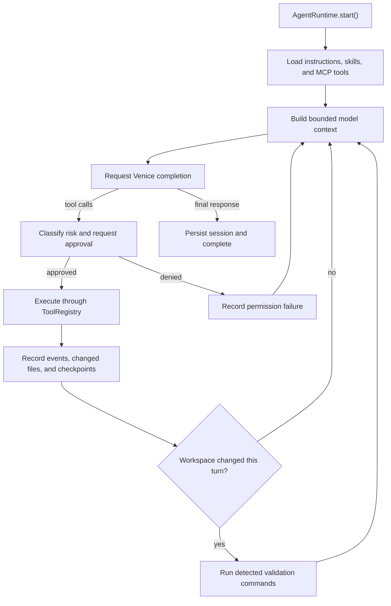

# Agent Runtime Architecture

## Scope

The agent runtime is a reusable orchestration layer around the Venice chat API.
It owns model turns, tool execution, permissions, context, persistence, and
validation. The Ink terminal UI and the noninteractive `venice agent` command
are adapters over the same runtime.

## Runtime lifecycle

`AgentRuntime` owns `AgentState`. `ContextManager` derives model input from that
state; tools receive a read-only state view plus narrow runtime services. UI
components consume events and invoke runtime methods but do not implement tool
or permission policy.

## State and persistence

The state records the objective, model, messages, todos, relevant and changed
files, tool history, skills, subagent reports, checkpoint availability, token
usage, and the last validation result. `SessionManager` persists state and the
append-oriented event log below `~/.venice/sessions/<session-id>/` using
user-only directory and file permissions.

Session listing and resume operations are scoped to the current canonical
workspace. Resuming a session from another workspace is rejected before runtime
state changes, and the resumed session reloads its own checkpoint history.

Context compaction creates a structured summary while preserving the objective,
constraints, failures, todos, and changed-file state. Source summaries are not
treated as source truth; tools reread files when exact content matters.

## Tool and permission boundary

Every capability implements `AgentTool` and is registered in `ToolRegistry`.
The runtime resolves model tool calls only through this registry, classifies the
requested operation, obtains approval when required, executes it with a
workspace-scoped `ToolContext`, and records the real result.

`WorkspaceManager` canonicalizes paths and rejects traversal, absolute external
paths, and symlink escapes. Changed-file tracking is session-scoped and
accumulates across tool calls. Filesystem mutations record parent-session
checkpoints before writing.

The four approval modes are `suggest`, `auto-edit`, `auto`, and `yolo`.
Destructive shell operations never become implicitly approved. MCP and
Venice-native network tools remain subject to the same risk classifier and
permission manager as built-in tools.

## Instructions, skills, and MCP

The instruction resolver combines the built-in agent contract with repository
instructions (`AGENTS.md`, `VENICE.md`, and `.venice/instructions.md`) and
path-scoped nested instructions. Skills expose metadata first and load full
`SKILL.md` content only when selected.

`McpManager` starts configured stdio servers, discovers their tools, and adapts
them into namespaced `mcp:<server>:<tool>` entries. A failed server is isolated
and reported without terminating the whole agent session. Global MCP config is
read from `~/.venice/mcp.json`; workspace config can extend or override it from
`.venice/mcp.json`.

## Subagents

Subagents use a separate runtime, session id, model context, and bounded turn
limit. Read-only mode is the default and exposes only workspace inspection,
search, and read-only Git tools.

Write mode is explicit. The parent classifies it as a write-risk operation
before launch. The child receives only workspace read/edit tools—no shell,
network, MCP, media, or nested subagent tools—and uses `auto-edit` inside that
already-approved boundary. It shares the parent checkpoint manager and returns
all changed paths as `affectedFiles`, so parent events, state, automatic
validation, undo, and final reporting remain authoritative.

Subagent runs are currently sequential. Concurrent write-capable agents and
automatic conflict resolution are intentionally unsupported.

## Validation boundary

After any mutating tool call in a turn, the runtime detects project commands and
runs them through the validation tool subject to approval policy. Exit codes and
bounded output are stored in state and events. A model's narrative cannot turn a
failing command into success.

Repository release validation remains broader than runtime auto-validation:
contributors must run the project lint, test/build, package, and other applicable
release checks before publication.

## Privacy and security

Agent sessions are local and no telemetry is added by the runtime. Session and
checkpoint content is outside Venice's E2EE/TEE enclave guarantees. Users must
avoid placing secrets in prompts, workspace MCP configuration, skills, or files
that an approved tool can read. MCP servers and approved shell commands execute
as local processes with the user's operating-system privileges.

## Extension points

New tools should reuse existing API or service helpers, declare a conservative
risk level, enforce workspace/output limits, return structured failures, and add
deterministic tests. New UI features should subscribe to runtime events or call
public runtime methods rather than moving orchestration logic into React
components.
